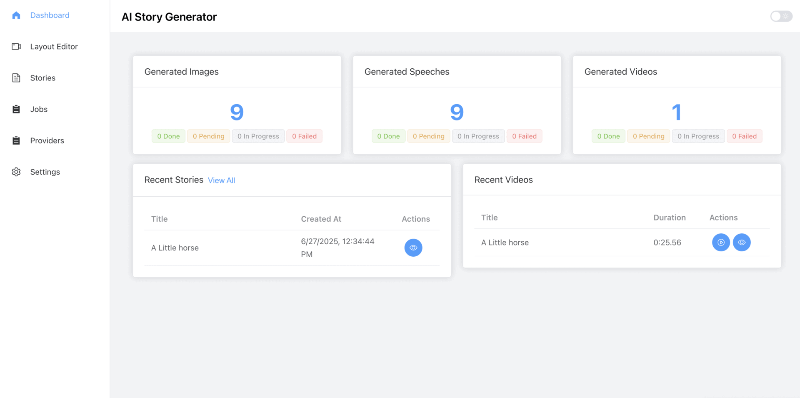

# AI Story Generator

[](https://nodejs.org/)
[](https://vuejs.org/)
[](https://www.docker.com/)
[](https://www.postgresql.org/)
[](https://redis.io/)
[](https://ffmpeg.org/)
[](https://www.typescriptlang.org/)
[](https://opensource.org/licenses/MIT)

This AI-powered application generates short stories with illustrations and voice narration using various AI providers. It then compiles everything into a video using FFmpeg.

## Running the project

Running the project
Before running the setup, make sure to copy the example environment file:

```bash
cp server/.env.docker server/.env && cp client/.env.example client/.env
```

Execute `dev-start.sh` and choose whether you want to run the server, the client or both. The script builds the Docker images and starts the containers defined in the compose files. PostgreSQL, Redis and RabbitMQ are started automatically for the server.

```bash
chmod +x dev-start.sh
./dev-start.sh
```

After the containers are up you can optionally seed the database when prompted.

The client is then available on port `5173` and the API on port `3000` by default.

## Providers and API keys

The application works with multiple AI providers. When you are not using the fake provider you must add your API keys for each service through the provider management endpoints.

Supported providers include:

- OpenAI for text and image generation
- Azure Speech for text‑to‑speech
- ElevenLabs for text‑to‑speech

## Fake Provider mode

To test the project without real provider credentials, enable Use Fake Provider in the Settings.
It simulates OpenAI and Azure responses, but still sends requests to Google TTS and picsum.photos.

## Purpose

This project was built in free time as a hobby to explore how AI can help create stories.
It explores the creative potential of combining AI-generated text, images, and speech into video content using FFmpeg.

## Demo Video

<a href="https://streamable.com/j9td2y" target="_blank">Watch the demo on Streamable</a>

## Preview



## Tech Stack

- **Frontend**: Vue.js 3, TypeScript, Tailwind CSS
- **Backend**: Node.js, Express, TypeScript (DI: tsyringe)
- **Database**: PostgreSQL with Prisma ORM
- **Cache & WebSocket Adapter**: Redis
- **WebSocket Communication**: Socket.IO
- **Message Queue**: RabbitMQ
- **Video Processing**: FFmpeg
- **Containerization**: Docker
- **AI Providers**: OpenAI, Azure Speech, ElevenLabs

## License

This project is licensed under the MIT License — feel free to use, modify, and share.
